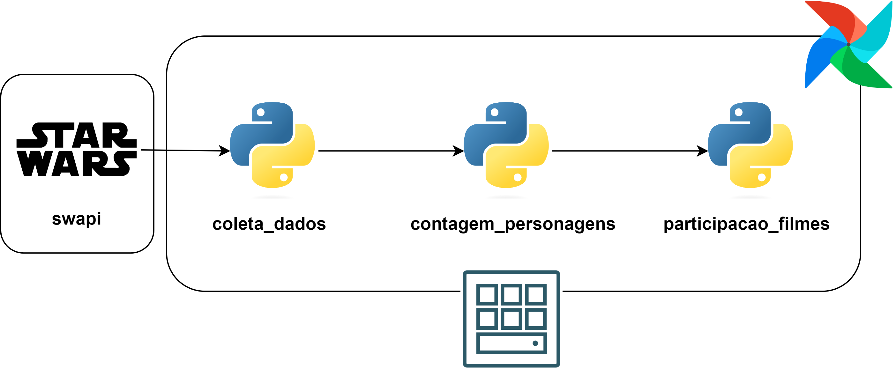

# Airflow Star Wars

🌌 Este projeto tem como objetivo realizar 
consultas a uma API da série Star Wars [Link text Here](https://link-url-here.org), realizar transformações nos dados obtidos e armazená-los utilizando scripts em **Python**, tendo o **Airflow** como orquestrador.

coleta_dados:
- Coleta dados dos paths *1. people, 2. films e 3. vehicles* da API, para todas as paginações.
- Agrupa os dados coletados no formato json por ano em pastas seguindo a estrutura de diretórios *{path}/{year}/{path}.json*.

contagem_personagens:
- Realiza o cálculo da quantidade de personagens, com base nos dados coletados para o path *people*.

participacao_filmes:
- Transforma a lista de filmes associadas a um personagem de urls para os títulos correspondentes, a partir da combinação dos dados do path *people* e do path *films*.
